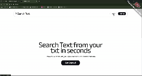

# Setup project
1. git clone https://github.com/MernDev0603/go-test.git
2. Retrieve env files (frontend/.env.local.example => frontend/.env.local)
3. Run docker
   ```
   docker-compose build
   docker-compose up
   ```
4. You can see website on http://localhost:3000

# Architect and design decision
1. What I did
  - Implement user authentication using clerk
  - Implement file upload and db connect with MySQL
  - Implement relevant chunk search using github.com/schollz/closestmatch
  - Implement file read/write and goroutines for concurrency
  - Docker for containerization
2. Plan to do
  - Implement cache system using github.com/patrickmn/go-cache to speed up repeated queries
  - Implement unit test for edge cases using github.com/stretchr/testify
  - Implement handling file uploads by queuing them into a buffered channel, then processing them asynchronously with worker goroutines to keep the request fast and the system responsive under load using RabbitMQ.

# Example queries and expected outputs

